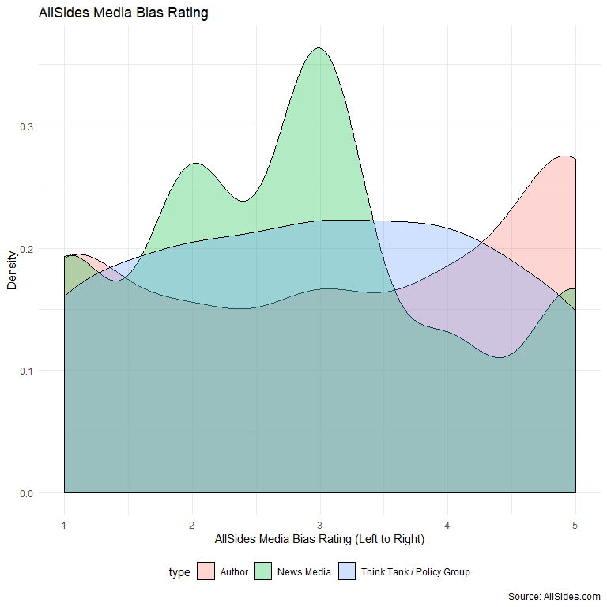

Latest Data Update: 2019-10-18

<!-- README.md is generated from README.Rmd. Please edit that file -->

# AllSideR

<!-- badges: start -->

<!-- badges: end -->

The goal of AllSideR is to provide you with the
[AllSides.com](https://www.allsides.com/media-bias/media-bias-ratings)
Media Bias rating dataset.

From AllSides.com:

> Our Media Bias Ratings are determined using multiple methods and
> represent the average judgment of Americans. They are based on blind
> surveys of people across the political spectrum, multi-partisan
> analysis, editorial reviews, third party data, and tens of thousands
> of user feedback ratings. Our scientifically-generated ratings are
> fluid and subject to change as new information is gathered and biases
> change over time.


The dataset looks like this:

<!-- # ```{r} -->

<!-- # readRDS("data/allsides_data.RDS") %>%  -->

<!-- #   dplyr::select(news_source, rating, rating_num, type, agree, disagree, perc_agree, dplyr::everything(), -community_feedback) -> allsides_data -->

<!-- #  -->

<!-- # tidytemplate::save_it(allsides_data) -->

<!-- #  -->

<!-- # readr::write_csv(allsides_data, path = "data/allsides_data.csv") -->

<!-- #  -->

<!-- # usethis::use_data(allsides_data) -->

<!-- # ``` -->

  - `news_source`: Rated entity
  - `rating`: AllSides Rating (left, left-center, center, right-center,
    right, allsides)
  - `rating_num`: Same as `rating` but numeric (from left to right,
    excluding “allsides” rating)
  - `type`: News entity type (can be news media, author or think
    tank/policy group)
  - `agree`: Number of people who agree with the rating
  - `disagree`: Number of people who disagree with the rating
  - `perc_agree`: Percentage of people who agree with the rating
  - `url`: URL with more Info
  - `editorial_review`: Was there an editorial review of the rating?
    (0/1)
  - `blind_survey`: Blind survey conducted? (0/1)
  - `third_party_analysis`: Based on third-party analysis? (0/1)
  - `independent_research`: Based on ndependent research? (0/1)
  - `confidence_level`: The confidence of the rating (Low or Initial
    Rating , Medium, High)
  - `twitter`: URL to Twitter account (when provided)
  - `wiki`: URL to Wikipedia article (when provided)
  - `facebook`: URL to Facebook page (when provided)
  - `screen_name`: Twitter screen name

## Get Dataset

Either Download data from GitHub Repo like this:

``` r
allsides_data <- readr::read_csv("https://raw.githubusercontent.com/favstats/AllSideR/master/data/allsides_data.csv")

allsides_data
#> # A tibble: 547 x 17
#>    news_source rating rating_num type  agree disagree perc_agree url  
#>    <chr>       <chr>       <dbl> <chr> <dbl>    <dbl>      <dbl> <chr>
#>  1 AARP        center          3 Thin…  1404     2343      0.375 http…
#>  2 ABC News    left-…          2 News… 13793     9409      0.594 http…
#>  3 Abridge Ne… allsi…         NA News…    31       17      0.646 http…
#>  4 Accuracy i… right           5 Thin…   743      444      0.626 http…
#>  5 ACLU        left-…          2 Thin…  1272     1697      0.428 http…
#>  6 AJ+         left            1 News…    13        5      0.722 http…
#>  7 Al Cardenas right           5 Auth…   353      238      0.597 http…
#>  8 Al Jazeera  left-…          2 News…  3707     6138      0.377 http…
#>  9 AllSides    allsi…         NA News…  3301     1308      0.716 http…
#> 10 AllSides C… allsi…         NA News…  2142     1273      0.627 http…
#> # … with 537 more rows, and 9 more variables: editorial_review <chr>,
#> #   blind_survey <dbl>, third_party_analysis <dbl>,
#> #   independent_research <dbl>, confidence_level <chr>, twitter <chr>,
#> #   wiki <chr>, facebook <chr>, screen_name <chr>
```

Or install package and use it from there:

``` r
devtools::install_github("favstats/AllSideR")

## Access dataset from package
AllSideR::allsides_data
```

## Example Plots

How does rating relate to agreement of the rating?

``` r
allsides_data %>% 
  ggplot(aes(rating_num, perc_agree*100)) +
  geom_jitter() +
  geom_smooth() +
  labs(x = "AllSides Media Bias Rating (Left to Right)", y = "% Agree",
       title = "AllSides Media Bias Rating X Agreement with Rating",
       caption = "Source: AllSides.com") +
  ggrepel::geom_text_repel(data = allsides_data %>% filter(perc_agree*100 > 80, rating_num %in% c(1:5)), 
                           aes(label = news_source)) +
  theme_minimal()
```

<!-- -->

People agree more on the bias of partisan media.

``` r
allsides_data %>% 
  mutate(partisan = case_when(
    rating_num %in% c(2, 4) ~ "Slightly Partisan",
    rating_num %in% c(1, 5) ~ "Partisan",
    rating_num == 3 ~ "Center"
  )) %>% 
  drop_na(partisan) %>% 
  mutate(partisan = fct_relevel(partisan, c("Center", "Slightly Partisan", "Partisan"))) %>% 
  ggplot(aes(partisan, perc_agree*100)) +
  geom_jitter(alpha = 0.4)  +
  geom_violin(alpha = 0.4) +
  geom_boxplot(width = 0.2)  +
  labs(x = "AllSides Media Bias Rating", y = "% Agree",
       title = "AllSides Media Bias Rating X Agreement with Rating",
       caption = "Source: AllSides.com") +
  theme_minimal()
```

<!-- -->

Finally, let’s take a look at the distribution of bias by source `type`.

``` r
allsides_data %>%
  ggplot(aes(rating_num, fill = type)) +
  geom_density(alpha = .3) +
  theme_minimal() +
  theme(legend.position = "bottom")  +
  labs(x = "AllSides Media Bias Rating (Left to Right)", y = "Density",
       title = "AllSides Media Bias Rating",
       caption = "Source: AllSides.com")  
```

<!-- -->

Lack of right-wing media is filled by “Author” category. Would be worth
investigating.
